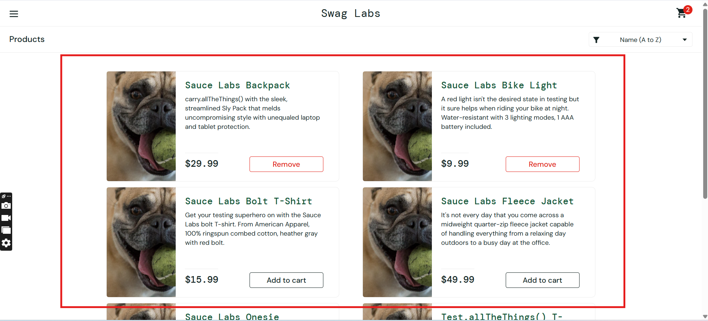

## Bug #1:Sorting functionality not working as per expectation

**Severity:** High  
**Priority:** P1  
**Environment:** Chrome 145, Windows 10, 1920x1080  
**User:** problem_user  
### Steps to Reproduce
1. Navigate to https://www.saucedemo.com/
2. Login with valid credentials username `problem_user` and password `secret_sauce`
3. User lands on Inventory page
4. On the inventory page, click on the sort filter dropdown, and observe
4. Select "Price (Low to High)"
5. Observe the order of the products and not changed
6. Select "Price (High to Low)"
7. Again observe the order of the products not changed.

### Expected Result
1. On selecting Price (Low to High), the product order should changed in ascending order as per the Price
2.  On selecting Price (High to Low), the product order should changed in descending order as per the Price

### Actual Result
No change in the product order while selecting the Sort filter from High to Low or vice- versa

### Evidence
<video controls src="20260228-0528-44.4524520.mp4" title="Title"></video>

## Bug #2:User not able to Remove added product from Cart from Inventory Page

**Severity:** High  
**Priority:** P1  
**Environment:** Chrome 145, Windows 10, 1920x1080  
**User:** problem_user  
### Steps to Reproduce
1. Navigate to https://www.saucedemo.com/
2. Login with valid credentials username `problem_user` and password `secret_sauce`
3. User lands on Inventory page
4. On the Inventory Page, add a Product in Cart
5. Now, click on Remove button and observe

### Expected Result: 
1. Remove button should be clickable.
2. On clicking on Remove button, the product should be removed from Cart

### Actual Result:
Remove button not clickable, so user unable to remove product from Cart

### Evidence
<video controls src="20260228-0530-21.3033165.mp4" title="Title"></video>

## Bug #3: Same Product Image displayed for Multiple items

**Severity:** Medium  
**Priority:** P2  
**Environment:** Chrome 145, Windows 10, 1920x1080  
**User:** problem_user  

### Steps to Reproduce
1. Navigate to https://www.saucedemo.com/
2. Login with valid credentials username `problem_user` and password `secret_sauce`
3. User lands on Inventory page
4. Observe the Image of the item

### Expected Result:
Product image should vary according to Product item

### Actual Result:
Same image is getting displayed for all Product item

### Evidence:

## Bug #4: Unable to Proceed with Checkout Page
**Severity:** Critical  
**Priority:** P1  
**Environment:** Chrome 145, Windows 10, 1920x1080  
**User:** problem_user  

### Steps to Reproduce
1. Navigate to https://www.saucedemo.com/
2. Login with valid credentials username `problem_user` and password `secret_sauce`
3. User lands on Inventory page
4. Add product to Cart
5. Navigate to Cart page
6. Click on Checkout button
7. User lands on Checkout page
8. Enter First Name
9. Enter Last Name and "observe"

### Expected Result:
User should be able to enter values in the give field and click on Continue button

### Actual Result:
When user enters value in Last Name field it auto redirects to First Name and start filling value there, due to which unable to proceed

### Evidence
<video controls src="20260228-0541-45.1093152.mp4" title="Title"></video>

## Bug #5: UI issues observed: Improper alignment of product elements observed on Inventory page

**Severity:** Medium  
**Priority:** P2  
**Environment:** Chrome 145, Windows 10, 1920x1080  
**User:** visual_user 

### Steps to Reproduce
1. Navigate to https://www.saucedemo.com/
2. 2. Login with valid credentials username `visual_user` and password `secret_sauce`
3. User lands on the inventaory page
4. On the Inventory Page, observe page layout, product images, product names, prices, and Add to Cart buttons

### Expected Result:
All product-related UI elements should be properly aligned, evenly spaced, and consistently displayed across all products.

### Actual Result:
UI elements are misaligned and inconsistently displayed, causing layout issues and poor user experience.

### Evidence:
<video controls src="20260228-0557-02.7674935.mp4" title="Title"></video>